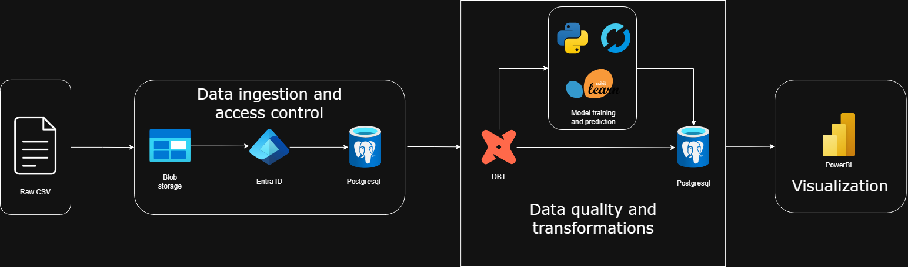
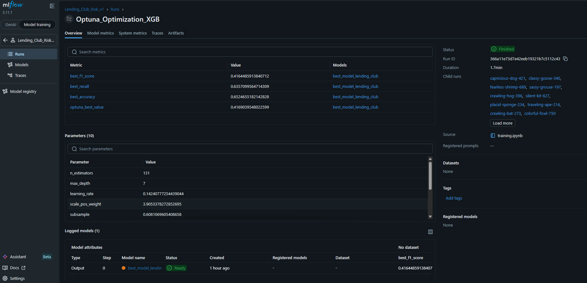

# Lending Club Loan Risk Analysis: End-to-End Cloud ML Pipeline



This project implements an enterprise-grade Machine Learning pipeline for loan default risk prediction, utilizing a Modern Data Stack entirely based in the cloud. The solution covers everything from bulk ingestion in Azure to interactive visualization in Power BI, including robust transformations with dbt and advanced experimentation with MLflow.

## Project Architecture

Unlike local approaches, this ecosystem uses managed infrastructure to ensure scalability and performance:

1.  **Data Lake**: Raw file storage (+2M records) in **Azure Blob Storage**.
2.  **Data Warehouse**: **Azure Database for PostgreSQL (Flexible Server)** as the central data engine.
3.  **Transformation (T)**: **dbt (Data Build Tool)** to modularize cleaning and dimensional modeling.
4.  **Machine Learning Lifecycle**: 
    - **Training**: XGBoost with **GPU** acceleration.
    - **Optimization**: Bayesian hyperparameter search with **Optuna**.
    - **Tracking**: Comprehensive experiment and model tracking in **MLflow**.
5.  **BI & Analytics**: Direct consumption of the dimensional model and predictions in **Power BI**.

## Tech Stack

| Layer | Tools |
| :--- | :--- |
| **Infrastructure** | Azure Blob Storage, Azure PostgreSQL |
| **Processing** | Python 3.11, psycopg2, SQL |
| **Transformation** | dbt Core 1.8 |
| **Machine Learning** | XGBoost (CUDA), Optuna |
| **MLOps** | MLflow |
| **Visualization** | Power BI Desktop & Service |

## Data and ML Pipeline

### 1. High-Performance Data Ingestion
An ingestion script (`data_process/ingesta.py`) was developed using the `azure_storage` extension for PostgreSQL. This allows for bulk `COPY` operations directly from Azure Blob Storage via SAS Tokens, eliminating local traffic bottlenecks.

### 2. Dimensional Modeling (Star Schema) with dbt
Raw data is transformed following data engineering best practices:
-   **Staging**: String cleaning, type normalization, and interest rate formatting.
-   **Marts**: Creation of an optimized Star Schema:
    -   `dim_borrower`: Demographic and employment information of the borrower.
    -   `dim_loan_details`: Specific credit details (amount, rate, purpose).
    -   `fact_loans`: Transactional facts and loan status.

### 3. Training and Optimization with MLflow
The ML process is managed entirely in `notebooks/training.ipynb`:
-   **Feature Engineering**: Direct consumption from dbt dimensional tables.
-   **Optuna**: Execution of 100+ trials to maximize F1-Score, handling class imbalance with `scale_pos_weight`.
-   **MLflow**: Logging of metrics (Accuracy, Recall, F1), Optuna parameters, and the final model artifact.



### 4. Universal Inference and Final Normalization
Once the best model is obtained, mass inference is performed on 100% of the clients (active and historical). The results (probabilities and predictions) are exported to the `fact_predictions` table in PostgreSQL, integrating with the Star Schema for analysis in Power BI.

## Visualization (Power BI)
The final dashboard connects to Azure PostgreSQL to cross-reference loan facts with ML model predictions.
-   **Risk Analysis**: Distribution of `risk_score` by credit grade.
-   **Performance**: Monitoring of actual defaults vs. predictions.
-   **Segmentation**: Identification of high-risk profiles based on occupation and income levels.

## Configuration

1.  **Environment Variables**: Create a `.env` file based on `.env.example` with Azure credentials.
2.  **Ingesta**: `python data_process/ingesta.py`
3.  **Transformation**: 
    ```bash
    cd dbt_lending_club
    dbt run
    ```
4.  **ML Pipeline**: Run `notebooks/training.ipynb` to train, log in MLflow, and generate predictions.

---
*This project demonstrates the integration of modern data engineering and applied data science for financial decision-making.*
